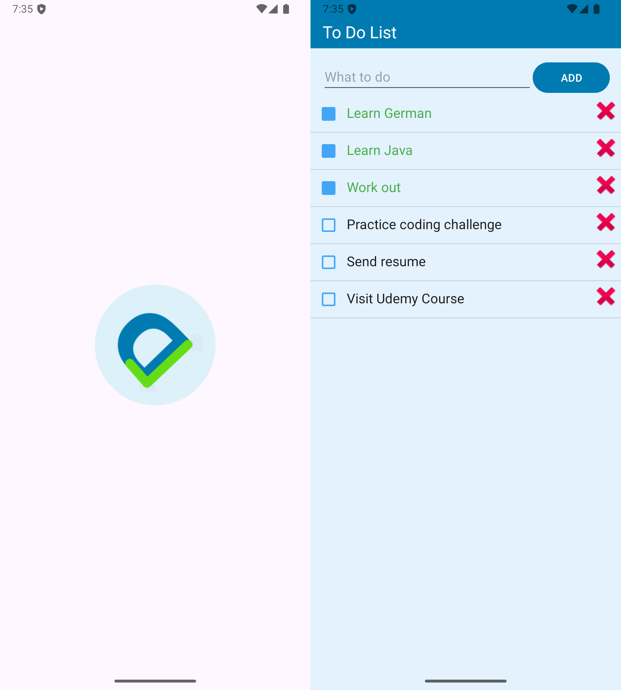

## 📝 To-Do List

Welcome to my very first Android project! This is a simple To-Do List App, built while learning Android development through a Udemy course. The project is written in Java and uses Android Studio for development. It helped me learn the basics of activities, custom adapters, file persistence, and UI components.

## 📱 Features

**Add** new tasks to your to-do list

**Check off** completed tasks with a checkbox

Task text turns green when checked

**Delete** tasks from the list

**Save** tasks using internal file storage

Checkbox status is remembered using **SharedPreferences**

## 🛠️ Tech Stack

Language: Java

IDE: Android Studio

UI: XML Layouts, Toolbar, ListView

Storage: Internal storage for saving list, SharedPreferences for checkbox states

## 📂 Project Structure

`MainActivity.java`: Handles UI logic, list population, and data persistence.

`CustomAdapter.java`: A custom adapter for displaying list items with checkboxes and delete buttons.

`FileHelper.java`: Manages reading and writing the task list to storage.

`item_list.xml`: Layout file for each individual list item.

`activity_main.xml`: Main layout containing EditText, Button, and ListView.

## 🧠 Lessons Learned
This project helped me understand:

Working with ListViews and custom adapters

Managing app data using internal storage

UI component interactions (EditText, Button, ListView, Checkbox)

Saving state using SharedPreferences

Building responsive UI with basic design elements

## 📝 Note: 
**This project is for learning purposes only and was developed by following a Udemy lesson with adaptation from tutorial.**

